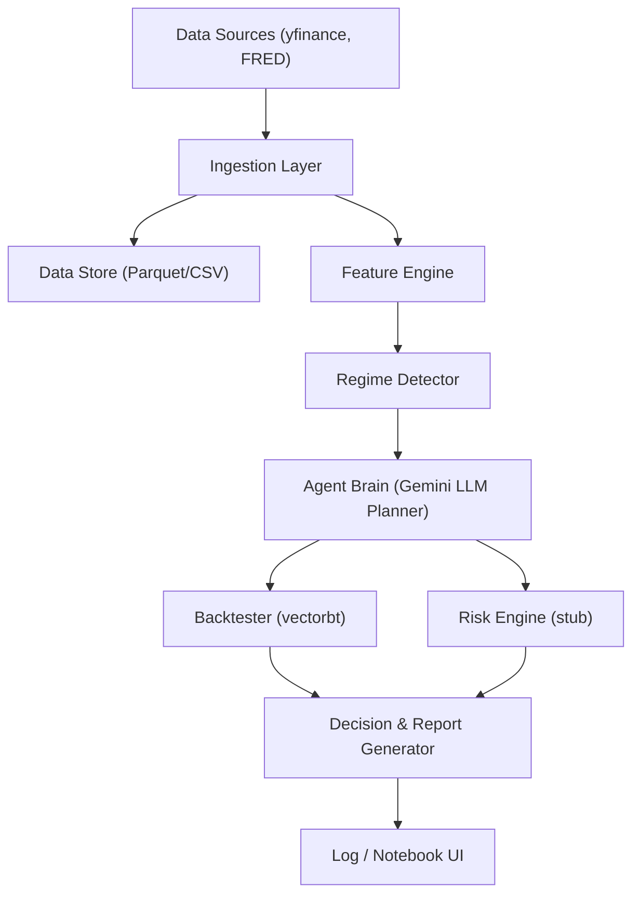

# Regime-Adaptive Trading Research Agent — Design Document

## 1. Goals
- Detect market regimes using free, public data sources.
- Continuously evaluate a library of trading strategies and adapt their parameters or suggest swaps.
- Operate autonomously under strict, pre-defined safety constraints, defaulting to a "propose-only" mode for human review.

## 2. Architecture Diagram

## 3. Agent Reasoning Loop

1.  **Trigger**: Manual trigger via notebook or future scheduler (e.g., cron).
2.  **Perceive**: Fetch the latest OHLCV data for a defined universe, VIX, and key macro indicators from FRED.
3.  **Feature Extraction**: Compute rolling volatility, momentum, correlation matrices, etc.
4.  **Regime Detection**: Classify the current market regime (e.g., `LowVol-Bull`, `HighVol-Bear`) using heuristics based on VIX and market trends.
5.  **Plan**: The Gemini LLM planner receives the current regime, key features, and a high-level goal. It proposes candidate actions, such as adjusting strategy parameters. It does this by calling a `backtest` tool.
6.  **Execute Tests**: The system runs fast, vectorized backtests on the candidates proposed by the LLM.
7.  **Evaluate & Decide**: The results of the backtests are compared. In the current PoC, the agent identifies the proposal with the highest Sharpe Ratio.
8.  **Log & Learn**: All actions, proposals, and outcomes are logged for review.

## 4. Safety & Policy
- The agent defaults to `suggest_only` mode. No trades are executed.
- All LLM-proposed actions are constrained to calling predefined tools (e.g., `backtest`), preventing arbitrary code execution.
- Risk checks (e.g., max drawdown) are applied to backtest results.

## 5. Technology Stack
- **LLM**: Google Gemini
- **Data**: yfinance, fredapi
- **Backtesting**: vectorbt
- **Core Libraries**: pandas, numpy
- **Configuration**: YAML, .env
