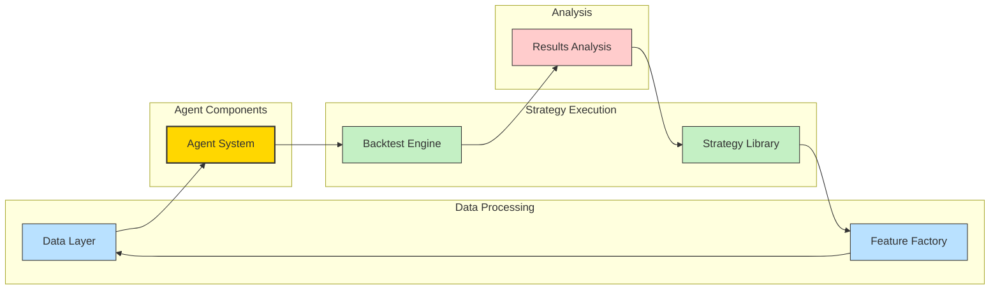

# Alpha Optimizer: AI-Powered Backtesting Platform

## Revolutionizing Investment Strategies with Agentic AI


*Harness the power of AI agents to transform your quantitative investment approach*

---

## The Problem: Traditional Backtesting Limitations

In today's fast-paced financial markets, traders and portfolio managers face critical challenges:

- **Manual Strategy Development**: Crafting trading strategies requires extensive domain knowledge and time-intensive coding
- **Limited Exploration**: Human bias restricts the universe of strategies explored
- **Static Approaches**: Most backtesting frameworks can't adapt to changing market conditions
- **Disconnected Processes**: Strategy development, testing, and optimization exist as separate workflows

Traditional backtesting tools lack the intelligence to autonomously discover, test, and refine trading strategies without constant human intervention.

## Our Solution: Agentic AI for Quantitative Finance

**AgentQuant** introduces a paradigm shift in strategy development using AI agents that think, plan, and execute like quantitative analysts:

- **AI-Powered Strategy Generation**: Autonomous agents create and test strategies across various market conditions
- **Dynamic Adaptation**: Agents evolve strategies in response to changing market regimes
- **End-to-End Automation**: From data ingestion to performance analysis, all managed by intelligent agents
- **Explainable Decision Making**: Transparent planning and reasoning through agent-based architecture

## Tech Stack

Our platform leverages modern technologies to deliver a powerful yet flexible backtesting environment:

- **Python Ecosystem**: Core implementation using Python 3.10+
- **Agent Framework**: 
  - LangChain and LangGraph for structured agent workflows
  - Custom-built planning and execution agents using LLM-based reasoning
- **LLM Integration**: Google's Gemini Pro model for strategy planning and analysis
- **Data Processing**: Pandas and Polars for high-performance data manipulation
- **Feature Engineering**: Specialized financial feature extraction with NumPy and SciPy
- **Performance Metrics**: Comprehensive risk and return metrics with empyrical
- **Storage**: Parquet files for efficient data storage and retrieval

## Architecture

AgentQuant implements a modular, agent-centric architecture:



### Key Components:

1. **Planning Agent**: Reasons about market conditions and selects appropriate strategies
2. **Execution Agent**: Implements trading decisions based on the planning agent's directives
3. **Feature Engine**: Transforms raw market data into actionable trading signals
4. **Backtest Runner**: Simulates strategy performance with realistic trading conditions
5. **Strategy Registry**: Extensible library of trading approaches that agents can employ

## Getting Started

```bash
# Clone the repository
git clone https://github.com/OnePunchMonk/AlphaOptimizer

# Install dependencies
pip install -r requirements.txt

# Run the Streamlit interface
python run_app.py
```

## Example: Agent-Driven Multi-Strategy Backtesting

```python
from src.agent.langchain_planner import generate_strategy_proposals
from src.backtest.runner import run_backtest
from src.data.ingest import fetch_ohlcv_data
from src.features.engine import compute_features
from src.features.regime import detect_regime

# Load data for multiple assets
data = {
    'SPY': fetch_ohlcv_data('SPY', '2018-01-01', '2023-01-01'),
    'QQQ': fetch_ohlcv_data('QQQ', '2018-01-01', '2023-01-01'),
    'TLT': fetch_ohlcv_data('TLT', '2018-01-01', '2023-01-01'),
    'GLD': fetch_ohlcv_data('GLD', '2018-01-01', '2023-01-01')
}

# Compute features and detect market regime
features = compute_features(data['SPY'])
regime = detect_regime(features)

# Generate diversified strategy proposals
strategies = generate_strategy_proposals(
    regime_data=regime,
    features_df=features,
    baseline_stats=pd.DataFrame(),
    strategy_types=['momentum', 'mean_reversion', 'volatility', 'trend_following'],
    available_assets=['SPY', 'QQQ', 'TLT', 'GLD'],
    num_proposals=5
)

# Run backtests with dynamic asset allocation
for strategy in strategies:
    results = run_backtest(
        data, 
        strategy['asset_tickers'], 
        strategy['strategy_type'], 
        strategy['params'],
        strategy['allocation_weights']
    )
    
    # Visualize results
    from src.visualization.plots import create_strategy_dashboard
    dashboard = create_strategy_dashboard(
        equity_curve=results['equity_curve'],
        weights_df=results['weights'],
        strategy_info=strategy,
        benchmark=data['SPY']['Close'],
        save_path='figures/latest'
    )
```

## Future Roadmap

Our vision extends beyond the current implementation:

- **Advanced Agent Architectures**: Implement more sophisticated agent reasoning with ReAct patterns and tool-use capabilities
- **Reinforcement Learning**: Training agents to optimize performance through market interactions
- **Market Regime Detection**: Enhanced automated identification of changing market conditions
- **Sentiment Analysis**: Incorporating alternative data sources for enhanced signal generation
- **Advanced Portfolio Optimization**: Modern portfolio theory with constraints and risk management
- **Multi-Strategy Ensembles**: Combine multiple strategies with dynamic weights based on market conditions
- **Hyperparameter Tuning**: Automated optimization of strategy parameters using Bayesian methods
- **Real-time Deployment**: Connect to broker APIs for paper and live trading capabilities

## Interactive User Interface

AgentQuant features a comprehensive Streamlit-based dashboard for visualizing and interacting with strategies:

- **Strategy Generation**: Create diverse strategies with a single click using AI agents
- **Portfolio Performance**: Interactive charts showing equity curves and benchmark comparisons
- **Asset Allocation**: Visual breakdown of portfolio composition over time
- **Strategy Formulas**: Mathematical representation of strategy logic
- **Hyperparameter Optimization**: One-click optimization to find the best parameters
- **Results Management**: Automatic saving of all backtest results with timestamp organization
- **Cross-Strategy Comparison**: Compare multiple strategies side-by-side

## Contribute

We welcome contributions from the quantitative finance and AI communities:

- Fork the repository
- Create a feature branch
- Submit a pull request

## License

This project is licensed under the MIT License - see the LICENSE file for details.

---

*AgentQuant: Where AI meets quantitative trading for unprecedented strategy discovery*
