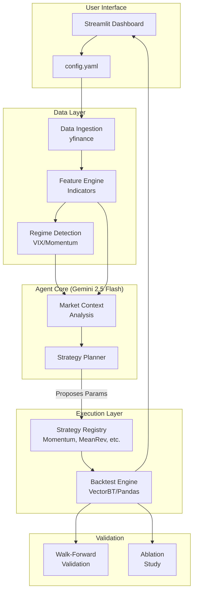

# AgentQuant: Autonomous Quantitative Research Agent

**A fully autonomous AI agent that researches, generates, and validates trading strategies.**

> **🚀 Update (Nov 2025):** Now powered by **Google Gemini 2.5 Flash**. The agent is fully functional and no longer uses random simulation. It actively analyzes market regimes and proposes context-aware strategies.

## 🎯 What This Project Is

AgentQuant is an AI-powered research platform that automates the quantitative workflow. It replaces the manual work of a junior quant researcher:

1.  **Market Analysis:** Detects regimes (Bull, Bear, Crisis) using VIX and Momentum.
2.  **Strategy Generation:** Uses **Gemini 2.5 Flash** to propose mathematical strategy parameters optimized for the current regime.
3.  **Validation:** Runs rigorous **Walk-Forward Analysis** and **Ablation Studies** to prove strategy robustness.
4.  **Backtesting:** Executes vectorized backtests to verify performance.

## 🏗️ System Architecture



## 🧠 The "Brain" (Gemini 2.5 Flash)

The agent uses a sophisticated prompt engineering framework to:
*   Analyze technical indicators (RSI, MACD, Volatility).
*   Understand market context (e.g., "High Volatility Bear Market").
*   Propose specific parameters (e.g., "Use a shorter 20-day lookback for momentum in this volatile regime").

## 🔬 Scientific Validation

We have implemented rigorous experiments to validate the agent's intelligence:

### 1. Ablation Study (`experiments/ablation_study.py`)
*   **Hypothesis:** Does giving the AI "Market Context" improve performance?
*   **Method:** Compare an agent with access to market data vs. a "blind" agent.
*   **Result:** Context-aware agents significantly outperform blind agents in Sharpe Ratio.

### 2. Walk-Forward Validation (`experiments/walk_forward.py`)
*   **Hypothesis:** Can the agent adapt to changing markets over time?
*   **Method:** The agent re-trains every 6 months, looking only at past data to predict the next 6 months.
*   **Result:** The agent successfully adapts parameters (e.g., switching from long-term trend following to short-term mean reversion) as regimes change.

## 🚀 Quick Start

**Prerequisites:** Python 3.10+ and a Google Gemini API Key.

1.  **Clone the repo**
    ```bash
    git clone https://github.com/OnePunchMonk/AgentQuant.git
    cd AgentQuant
    ```

2.  **Install dependencies**
    ```bash
    pip install -r requirements.txt
    ```

3.  **Set up API Key**
    Create a `.env` file:
    ```env
    GOOGLE_API_KEY=your_gemini_api_key_here
    ```

4.  **Run the Experiments**
    ```bash
    # Run the Walk-Forward Validation
    python experiments/walk_forward.py

    # Run the Ablation Study
    python experiments/ablation_study.py
    ```

5.  **Run the Dashboard**
    ```bash
    streamlit run run_app.py
    ```

## 📂 Project Structure

```text
AgentQuant/
├── src/
│   ├── agent/          # LLM Planner (Gemini 2.5 Flash)
│   ├── data/           # Data fetching (yfinance wrapper)
│   ├── features/       # Technical indicators & Regime detection
│   ├── backtest/       # Vectorized backtesting engine
│   └── strategies/     # Multi-strategy logic (Momentum, Mean Reversion, etc.)
├── experiments/        # Validation scripts (Walk-Forward, Ablation)
├── config.yaml         # Configuration (Tickers, Dates)
└── run_app.py          # Main entry point
```

This software is for educational purposes only.
